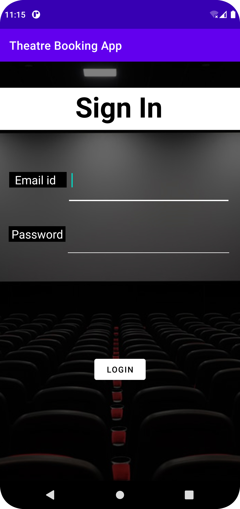
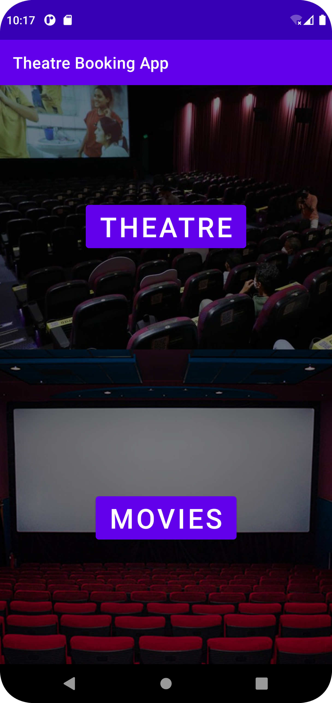
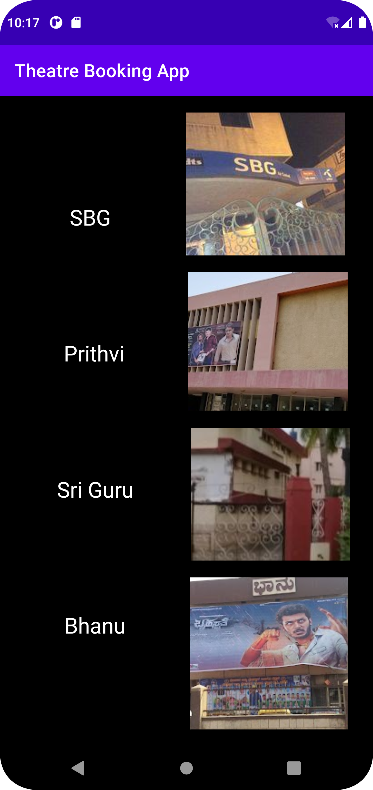
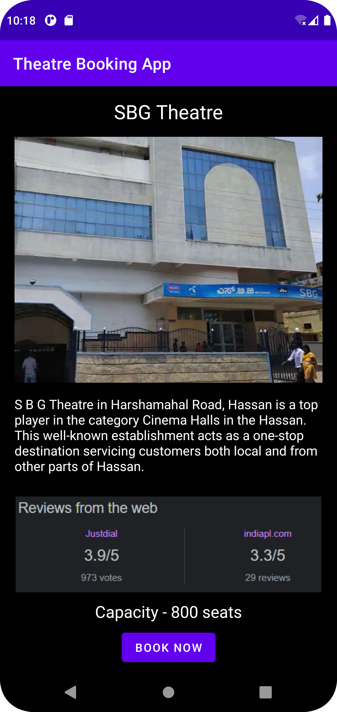
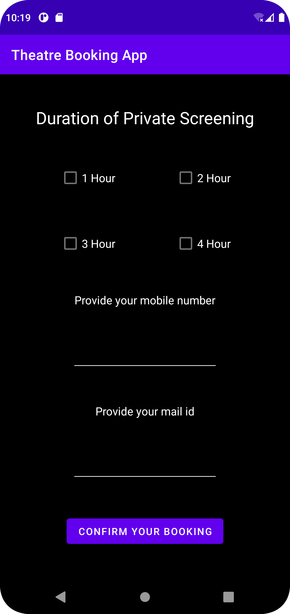
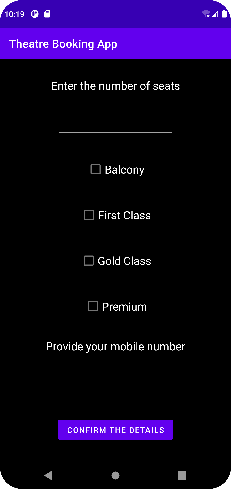
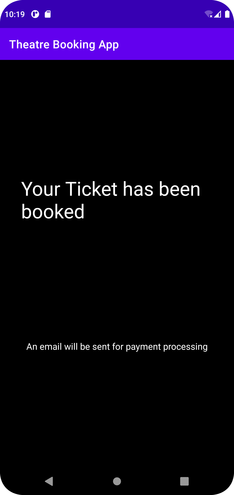
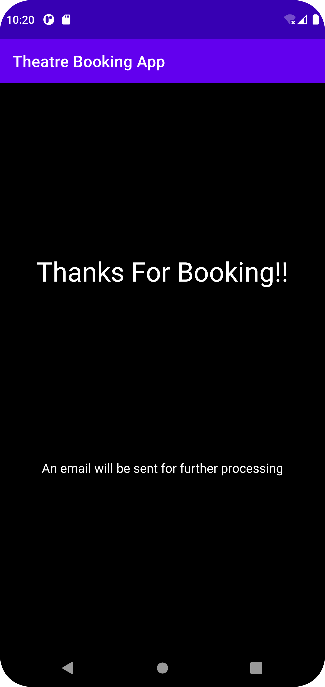

# 🎬 NammaScreen

> A mobile application built using Java and Android Studio to help small, local theatres bring their showtimes and bookings online.  
> Developed as a 6th-semester academic project, this app was designed with practicality, purpose, and just the right amount of chaos an engineering student brings to the table.

---

## 📌 About

**NammaScreen** was created with a clear mission – to bridge the gap between traditional local theatres and the world of online movie booking.

In many smaller towns, old and independently run theatres still rely on offline ticketing. With **NammaScreen**, the idea was to offer them an affordable digital solution for:

- Online ticket booking  
- Seat selection  
- Private screenings  
- Email-based booking receipts  
- And Firebase-powered login via Gmail

Some of these features were fully implemented, while others remained exciting concepts due to the constraints of a semester-long project – but the foundation was solid.

---

## ✨ Features

- 🔐 **Firebase Authentication** – Users can sign in securely via Gmail
- 🎟 **Movie & Theatre Selection** – Pick your movie, select the theatre, and book away
- 🪑 **Seat Selection UI** – Interactive seat picker for smoother booking
- 📧 **Email Booking Receipt** – After booking, a ticket summary lands in your inbox
- 👥 **Private Screening Support** – Concept for booking private theatres for events and functions
- 📱 **Clean Android UI** – Built with XML layouts and Java in Android Studio

---

## 📸 Screenshots

Here’s a glimpse of what NammaScreen looks like in action (screenshots taken directly from the app):

    

    

    

  

> *All screenshots are located in* `NammaScreen/app/` *within the repository.*

---

## 🛠 Tech Stack

- **Language**: Java  
- **IDE**: Android Studio  
- **Backend/Database**: Firebase Realtime Database + Firebase Authentication  
- **Email System**: Java Mail API  
- **Authentication**: Google Sign-In via Firebase 
